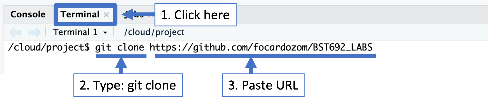
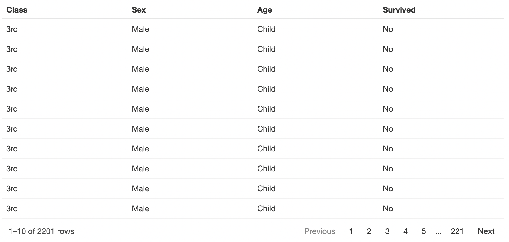
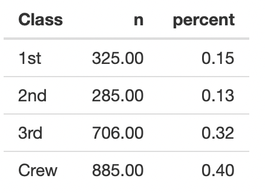

##  Labs BST692: TITANIC dataset

---

### Lab2

#### Objective:

Import data, create a table and reactable in Shiny 

#### Step 1

Open the project *Shiny_labs* on RstudioCloud. 

#### Step 2

Clone this GitHub repo https://github.com/focardozom/BST692_LABS

#### Step 3

Open the `app.R` file

#### Step 4

#### <mark>Go to server:</mark>

Import the `Titanic` data into your shiny. Save the data into an object called 'the_data'. **Be aware that the `Titanic` data set is in weighted format**. 

> `the_data <- ???`

**Hints:**

> data("dataset_name") # this function loads the data in the R enviroment  
> as_tibble() # To create a tibble  
> uncount()   # To unnest/ungroup/unweighted or exand the dataset  

#### Step 5

Create a `reactable` object to display the data set. 

It should look like this:

**Hints:**

> output$??? <-  
> renderReactable()  
> reactable()  

#### Step 6

Create a table object to display the count of passanger for each class and crew.

It should look like this:

**Hints:**  

> output$???  <-  
> renderTable({})  
> tabyl(Class)  
> adorn_rounding(2)  

#### Step 7

#### <mark>Go to UI:</mark>

Create an output object of class `table`. 

Hints:

> tableOutput("???")  
> [Shiny Cheat Sheet](https://shiny.rstudio.com/images/shiny-cheatsheet.pdf)

#### Step 8

Create an output object of class `reactable`

Hints:

> reactableOutput("???")

#### Step 9

Save the app.R file

#### Step 10

Click `Run app` bottom to deploy your shiny app. 

