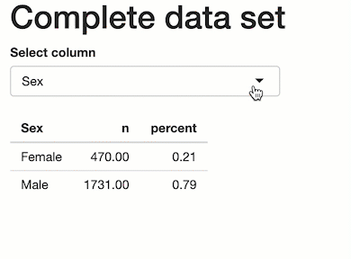

##  Labs BST692: TITANIC dataset

---

### Lab3

#### Objective:

Include reactivity in your Shiny 

#### Step 1

Open the project *Shiny_labs* on Rstudio.Cloud. 

#### Step 2

Pull GitHub repo https://github.com/focardozom/BST692_LABS

#### Step 3

Open the `app.R` file.

#### Step 4

#### <mark>Go to UI:</mark>

In your UI, create a `selectizeInput` object. Locate the `selectizeInput` input before the  `tableOutput`. 

**Hints:**

`selectizeInput` require these three arguments:

> **name** # this is the object's id  
> **label** # text desplayed in the UI  
> **choices** # options desplayed in the menu  

#### Step 5

#### <mark>Go to server:</mark>

In your server, identify the `output$` object containing the table. Replace the grouping variable in the `tabyl()` function with the name of the `selectizeInput` object. Remember to include `input$` followed by the object's name. 

**Hints:**

> input$SELECTIZEINPUT_NAME  

#### Step 6

Save the app.R file

#### Step 7

Click `Run app` button to deploy your shiny app. 

