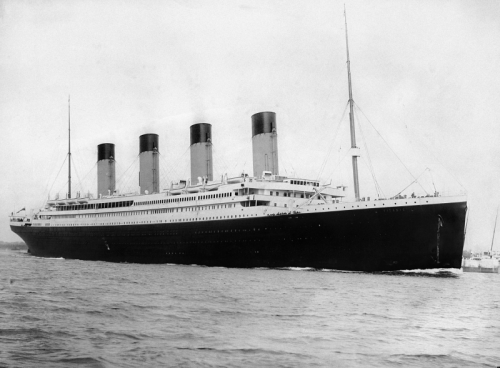

# Titanic: Who Survived?

More than 110 years ago, the Titanic sank after striking an iceberg.

*Imagen taken from* [here](https://en.wikipedia.org/wiki/Titanic#/media/File:RMS_Titanic_3.jpg)

> The Titanic sank in the early hours of April 15, 1912.

## Passengers and Crew

The total number of people on board was 2,240 (passengers and crew). Unfortunately, approximately 1,500 of them lost their lives.

**The Titanic offered three different types of tickets**

1. First Class: USD 4500
1. Second Class: USD 2000
1. Third Class: USD 1000
*Approx cost (2017)*
      
[John Jacob Astor was the wealthiest passenger](https://www.history.com/this-day-in-history/john-jacob-astor-is-born)

## Database

In this lab, we will use the `Titanic` data set from the `datasets` package.

The dataset contains information about the Titanic passengers: 

* Class
* Sex
* Age 
* Survival
